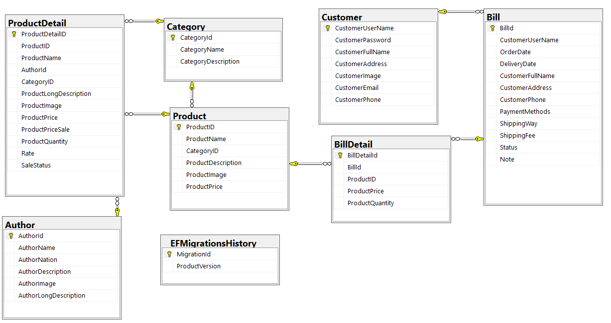

# 📚 EShop - Online Bookstore

**EShop** is a web-based bookstore built with ASP.NET MVC, designed to provide users with a smooth and secure experience for browsing, purchasing, and managing books. The system supports user authentication, shopping cart functionality, order management.

This project is powered by SQL Server for robust data management and follows the MVC pattern for clean separation of concerns. Ideal for learning modern .NET web development and deploying scalable eCommerce applications.

## 🚀 Features

### 🧑‍💻 User
- User authentication (register/login/logout)
- Browse product catalog with filters and search
- Product detail pages with ratings & reviews
- Add to cart, update quantity, and remove items
- Checkout flow with order summary and confirmation

## 🏛️ Database Diagram

Here’s the database structure for **EShop**:

